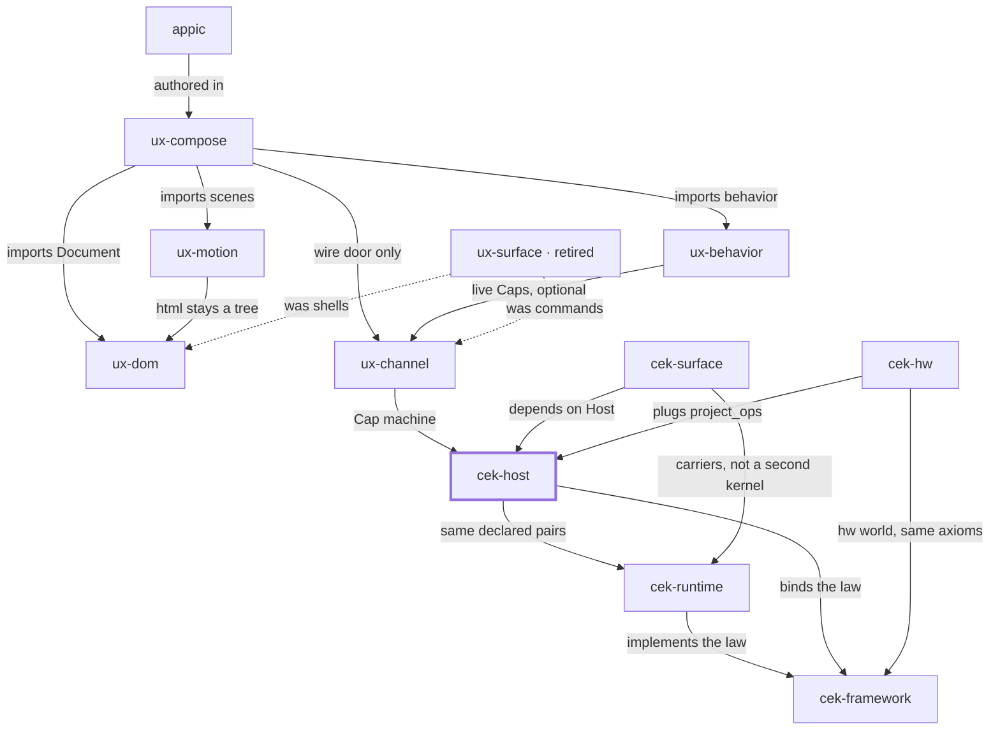
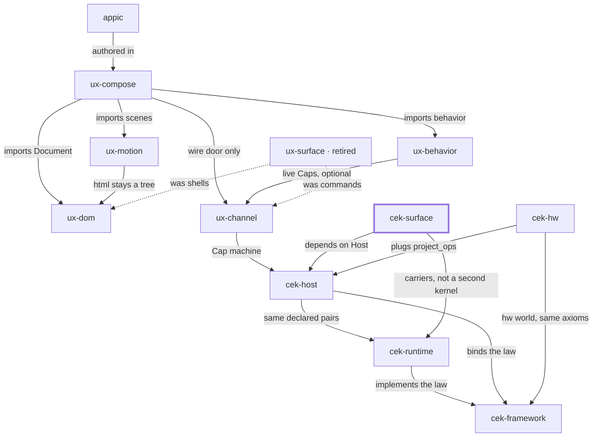

# Place in the stack

This repo publishes two libraries on one tag. Both are 0.2.0. Versions before 0.2.0 teach `cek_host.legal` and are yanked. An exact pin still installs that old law.

The picture is the same in every repo. A missing line is a missing door. Dashed lines are history.

---

# Place in the stack

**You are here:** `cek-host` in [bitplorer/cek-python](https://github.com/bitplorer/cek-python).

The Python authority. It mints and verifies Caps, consumes a once-Cap before side effects, and projects ops. It does not apply the world. A refusal means ops is empty.

The picture is the same in every repo. The thick stroke is this library. A missing line is a missing door, not a forgotten one. Dashed lines are history.

## Owns

Mint, verify, once, sealed args, the declared catalog, and lineage.

## Refuses

Applying peer effects. A second catalog. Modes other than dev and prod. The old module cek_host.legal.

## Install

pip install cek-host. Version 0.2.0, published with cek-surface from this repo.

## Doors

### Uses

- [cek-runtime](https://github.com/bitplorer/cek-runtime) — same declared pairs
- [cek-framework](https://github.com/bitplorer/cek-framework) — binds the law

### Used by

- [ux-channel](https://github.com/bitplorer/ux-channel) — Cap machine
- [cek-surface](https://github.com/bitplorer/cek-python) — depends on Host
- [cek-hw](https://github.com/bitplorer/cek-hw) — plugs project_ops

## The stack

## The walk

Mint, intent, verify, project, apply, undo.

1. **Mint.** **This library.** Host mints a Cap. The subject on the Cap is the subject in the args. dev is the workshop. prod refuses the workshop secret.
2. **Intent.** Channel carries action, args, and cap. That is the click. It is not a form post.
3. **Verify.** Host verifies the Cap before any shared-world write. A bad Cap, or a store that is down, refuses. ops is empty. The peer never mints.
4. **Project.** Only declared pairs leave the host. Baseline and ui.dom are the catalog. Hardware pairs arrive through project_ops. They are not a fork of Host.
5. **Apply.** The peer applies the ops. DOM is one world. GPIO is another. Surface carries the IR. It does not decide.
6. **Undo.** Lineage records the cause. End or revoke reverses it, or the op is marked non-reversible. A trace id never grants permission.

cek-host is step 1 of the walk.

## Notes

- Public names are in_catalog, CATALOG_PAIRS, and UndeclaredPair.
- There is no law noun S.
- 0.1.0, 0.1.2, and 0.1.3 are yanked. An exact pin still installs them.

---

# Place in the stack

**You are here:** `cek-surface` in [bitplorer/cek-python](https://github.com/bitplorer/cek-python).

Compose ops, peer IR, and carriers. It sits on Host. It does not grow a second Cap machine. A continuation is minted. A replay does not arm a new one.

The picture is the same in every repo. The thick stroke is this library. A missing line is a missing door, not a forgotten one. Dashed lines are history.

## Owns

Op composition, peer IR, carriers, and mint_continuation.

## Refuses

A private copy of the catalog machine. Host modes named demo and production.

## Install

pip install cek-surface. Version 0.2.0. Depends on cek-host. Same tag.

## Doors

### Uses

- [cek-host](https://github.com/bitplorer/cek-python) — depends on Host
- [cek-runtime](https://github.com/bitplorer/cek-runtime) — carriers, not a second kernel

## The stack

## The walk

Mint, intent, verify, project, apply, undo.

1. **Mint.** Host mints a Cap. The subject on the Cap is the subject in the args. dev is the workshop. prod refuses the workshop secret.
2. **Intent.** Channel carries action, args, and cap. That is the click. It is not a form post.
3. **Verify.** Host verifies the Cap before any shared-world write. A bad Cap, or a store that is down, refuses. ops is empty. The peer never mints.
4. **Project.** Only declared pairs leave the host. Baseline and ui.dom are the catalog. Hardware pairs arrive through project_ops. They are not a fork of Host.
5. **Apply.** **This library.** The peer applies the ops. DOM is one world. GPIO is another. Surface carries the IR. It does not decide.
6. **Undo.** Lineage records the cause. End or revoke reverses it, or the op is marked non-reversible. A trace id never grants permission.

cek-surface is step 5 of the walk.

## Notes

- Surface re-exports the catalog. It does not redefine it.
- The pre-0.2 wheels are yanked, same as cek-host.

